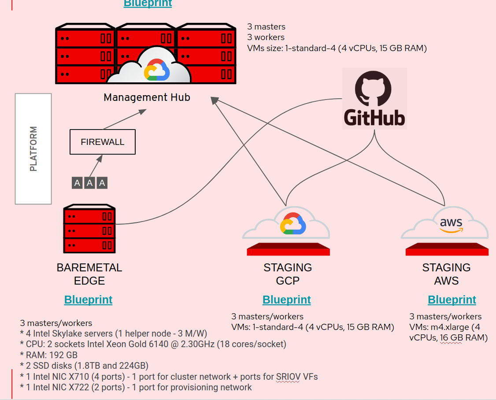

# Industrial Edge Computing MVP

This repository contains the required documentation in order to deploy the Industrial Edge Computing MVP. The MVP solution has been designed and built using Red Hat technologies and fulfils requirements from the manufacturing industry.

## Testbed

The architecture of the testbed is formed by four different clusters:

- 1 management hub
- 2 staging edge computing sites
- 1 baremetal edge computing site

The following picture shows a diagram of the testbed:



The management hub site is a 6 nodes OpenShift 4.5 cluster (3 masters and 3 workers) running the required components to allow CI/CD pipelines, managing edge computing sites and gathering data from them. This cluster is completely described by the [blueprint-management-hub](https://github.com/redhat-edge-computing/blueprint-management-hub). 

The 2 staging and the baremetal edge computing sites share the same number of nodes. These sites are full HA OpenShift 4.5 hyperconverged clusters composed by only 3 nodes that have both master and worker roles. This small footprint is suitable for running on edge locations such as manufacturing plants. The three sites are also descibed by the [blueprint-industrial-edge] (https://github.com/redhat-edge-computing/blueprint-industrial-edge). However the staging sites are running on public clouds (GCP and AWS) while the baremetal edge site works under the conditions of a real industrial factory (restricted network, behind firewall, local storage, etc...).

We have created a wrapper in order to deploy OpenShift clusters described by _blueprints_. Please, check out the following link: [https://github.com/redhat-edge-computing/kni-openshift-installer](https://github.com/redhat-edge-computing/kni-openshift-installer)

## Demo script

In order to test the whole solution, the following high level steps are required:

  1.- Deploy Management Hub: the definition of this site is located in the following [repo](https://github.com/redhat-edge-computing/blueprint-management-hub/tree/master/sites/edge-mgmt-hub.gcp.devcluster.openshift.com).
      Once the deployment has finished, a 6 nodes cluster will be running on GCP with a set of components:
      - Red Hat Advanced Cluster Manager
      - List of pre-provisioned cluster to be imported (3 remote edge computing sites)
      - OpenShift pipelines
      - ArgoCD Operator

  2.- Create `kubeconfighub.json` file with a base64 encoded version of the kubeconfig file from the recently deployed cluster (`base64 -w0 $HOME/.kni/edge-mgmt-hub.gcp.devcluster.openshift.com/final_manifests/auth/kubeconfig > $HOME/.kni/kubeconfighub.json`)

  3.- Workaround due to ACM bug. Please, check out the ACM note section at the end of this document. 

  4.- Deploy Edge Computing cluster and workloads running on top.

Once these steps have been executed, you will have all the infrastructure in place to demo the Manufacturing Edge Lightweight Application.


## Demo execution

This section describes all technical steps you need in order to deploy the whole solution based on the repositories hosted in the `redhat-edge-computing` Github org.

### Prepare server/machine to perform deployment

We use a helper tool called `knictl` in order to render the blueprints. You first need to download and build this tool in your GOPATH:

```
cd $GOPATH/src
mkdir -p gerrit.akraino.org/kni/
cd gerrit.akraino.org/kni/
git clone "https://gerrit.akraino.org/r/kni/installer"
cd installer
make build
```

Create a `$HOME/.kni` folder and copy the following files:

+ **id_rsa.pub** → needs to contain the public key that you want to use to access your nodes
+ **pull-secret.json** → needs to contain the pull secret downloaded from [https://cloud.redhat.com/openshift/install](https://cloud.redhat.com/openshift/install)

Furthermore, our Industrial Edge Computing MVP performs CI/CD pipelining in order to automatically push new changes/images and deploy them via gitops on remote sites. You need a GitHub account that can access the chosen GitOps repository (see below) and have a Personal Access Token with "repo" permissions. The user and token must be encoded in base64 and pasted in `$HOME/.kni/githubsecret.json` in the following form:

```
{
  user: xxxxxxx
  token: xxxxxxxxxxxxxxxxxxxxxxxxxxxxxxxxxxxx
}
```

### Deploy Management Hub Blueprint

The site definition for the Management Hub Blueprint points to a GCP profile. This implies that first of all you need to have your Google Cloud Platform service account file located in the following path:

`$HOME/.gcp/osServiceAccount.json`

The OpenShift installer binary will read that file if gcp is set as a platform. From the path where the knictl binary is located, and in order to pull our edge-mgmt-hub site and its requirements, please execute:

`knictl fetch_requirements github.com/redhat-edge-computing/blueprint-management-hub/sites/mgmt-edge-hub.gcp.devcluster.openshift.com/`

This command will download the site blueprint definition, and all its requirements (oc, openshift-install, kustomize, etc) to the $HOME/.kni/. Every site will have a separate directory within that location. The next step involves the actual rendering of the manifests (site + profile + base) into one set of manifests via kustomize that we can pass to the openshift-install binary.

`knictl prepare_manifests edge-mgmt-hub.gcp.devcluster.openshift.com`

If everything goes well, the command will get out some instructions to deploy the cluster. It's basically asking you to run openshift-install binary pointing to where the final manifests created by knictl are:

`$HOME/.kni/edge-mgmt-hub.gcp.devcluster.openshift.com/requirements/openshift-install create cluster --dir=$HOME/.kni/edge-mgmt-hub.gcp.devcluster.openshift.com/final_manifests --log-level debug`

Wait until the deployment is completed, and you will information about console endpoint, kubeadmin password and kubeconfig path.

### Day 2 operations in Management Hub cluster

Once we have the cluster up and running, we can now apply the Day 2 workloads that run on top of the management hub cluster such as Tekton, ArgoCD, ACM, etc.

`knictl apply_workloads edge-mgmt-hub.gcp.devcluster.openshift.com`

This is basically running kustomize to build and render all the manifests enabling alpha plugins, and apply them via oc/kubectl.


### Run Seed Pipelines

The following commands will run 4 pipelines in order to build container images and feed the configuration in order to make the pods from the manuela-tst-all namespace work as expected.


```
oc apply -f ~/.kni/edge-mgmt-hub.gcp.devcluster.openshift.com/blueprint/base/03_services/tekton/seed-iot-anomaly-detection-run.yaml -n manuela-ci

(wait till the pipelinerun is finished)

oc apply -f ~/.kni/edge-mgmt-hub.gcp.devcluster.openshift.com/blueprint/base/03_services/tekton/seed-iot-consumer-run.yaml -n manuela-ci

(wait till the pipelinerun is finished)

oc apply -f ~/.kni/edge-mgmt-hub.gcp.devcluster.openshift.com/blueprint/base/03_services/tekton/seed-iot-frontend-run.yaml -n manuela-ci

(wait till the pipelinerun is finished)

oc apply -f ~/.kni/edge-mgmt-hub.gcp.devcluster.openshift.com/blueprint/base/03_services/tekton/seed-iot-software-sensor-run.yaml -n manuela-ci
```

### Create kubeconfighub.json

The Management Hub cluster runs the Red Hat's Advance Cluster Manager, and it has a list of three managed clusters preprovisioned. This will allow us to automatically register those three remote clusters into ACM once they are deployed. In order to perform this "self-registration" process, we need to encode in base64 the content of the kubeconfig file from the hub cluster and place it in `$HOME/.kni/kubeconfighub.json`. This can be achieved by executing the following command:

`base64 -w0 ~/.kni/edge-mgmt-hub.gcp.devcluster.openshift.com/final_manifests/auth/kubeconfig > ~/.kni/kubeconfighub.json`

Please, take into account the name/domain of your hub cluster in order to make this command work.


### ACM Note

The current version of ACM (2.0) has a known bug that is being resolved. The bug prevents to propagate the subscription properly when its channel is created simultaneously. In order to work around this issue, please, create a fake annotation to the following subscription:

`oc edit appsub argocd-sub -n argocd`

And add something like:

```
    open-cluster-management.io/user-group: c3lzdGVtOm1hc3RlcnMsc3lzdGVtOmF1dGhlbnRpY2F0ZWQ=
    open-cluster-management.io/user-identity: c3lzdGVtOmFkbWlu
    test: fake
    creationTimestamp: "2020-09-21T10:36:26Z"

```


### Deploy staging edge site on GCP

Now all the required infrastructure is in place, we can deploy the staging-edge cluster on GCP based in the blueprint-industrial-edge repository. Please, check the following link to check instructions on how to deploy it:

[https://github.com/redhat-edge-computing/blueprint-industrial-edge/tree/master/sites/staging-edge.gcp.devcluster.openshift.com](https://github.com/redhat-edge-computing/blueprint-industrial-edge/tree/master/sites/staging-edge.gcp.devcluster.openshift.com)


### MANUela check points


#### Use Cases / Demo Modules

Once the management hub cluster and the staging cluster running on GCP are up and running, the platform is ready to perform some demo flows that will show how we can manage clusters and applications in the edge using gitops. 

- GitOps app deployment [preparation](./docs/module-app-deployment.md#Demo-preparation) - [demo execution](./docs/module-app-deployment.md#Demo-execution)
- GitOps configuration management [preparation](./docs/module-configuration-management.md#Demo-preparation) - [demo execution](./docs/module-configuration-management.md#Demo-execution)
- Code change [preparation](./docs/module-code-change.md#Demo-preparation) - [demo execution](./docs/module-code-change.md#demo-execution)
-  CI/CD pipeline & GitOps staging [preparation](./docs/module-ci-cd-pipeline.md#Demo-preparation) - [demo execution](./docs/module-ci-cd-pipeline.md#Demo-execution)
- Event streaming from edge to core & filling the data lake [preparation](./docs/module-event-streaming.md#Demo-preparation) - [demo execution](./docs/module-event-streaming.md#Demo-execution)
- Machine learning [preparation](./docs/module-machine-learning.md#Demo-preparation) - [demo execution](./docs/module-machine-learning.md#Demo-execution)
- Infrastructure operator development [preparation](./docs/module-infrastructure-operator-development.md#Demo-preparation) - [demo execution](./docs/module-infrastructure-operator-development.md#Demo-execution)
- Enterprise Container [preparation](./docs/module-enterprise-container.md#Demo-preparation) - [demo execution](./docs/module-enterprise-container.md#Demo-execution)
- Multi Cluster Management [preparation](./docs/module-multicluster.md#Demo-preparation) - [demo execution](./docs/module-multicluster.md#Demo-execution)

