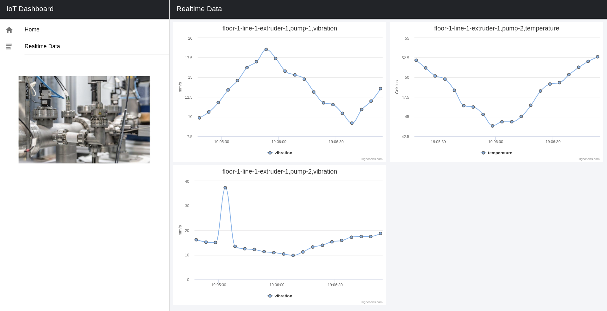
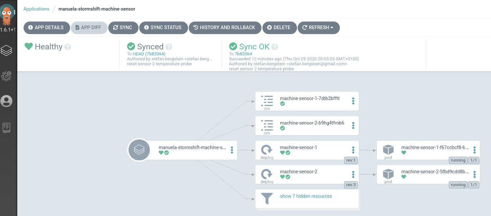
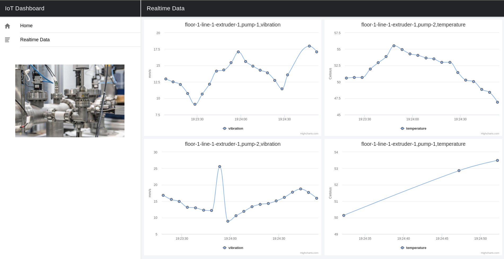

# Gitops Configuration Management  <!-- omit in toc -->
This document describes how to prepare & execute the  gitops config management demo

- [Prerequisites](#prerequisites)
- [Demo Preparation](#demo-preparation)
  - [Disable temperature in sensor 2 / revert to default (which is disabled)](#disable-temperature-in-sensor-2--revert-to-default-which-is-disabled)
  - [Sync ArgoCD](#sync-argocd)
- [Demo Execution](#demo-execution)
  - [Show that Sensor 2 currently does not send temperature data in IoT dashboard](#show-that-sensor-2-currently-does-not-send-temperature-data-in-iot-dashboard)
  - [Wait for ArgoCD to sync application / trigger sync for machine-sensor](#wait-for-argocd-to-sync-application--trigger-sync-for-machine-sensor)
  - [Show that sensor now sends temperature data](#show-that-sensor-now-sends-temperature-data)

## Prerequisites


The management hub and factory edge clusters are up and running, sensor data is flowing into the IoT dashboard.
During the deployment you forked and cloned manuela-gitops on your local machine.


To open the IoT dashbaord, either login into the OpenShift console of you factory edge clusters and navigate to the ```line-dashboard``` route in the ```manuela-stormshift-line-dashboard``` namespace or logon via ```oc``` cli into the  edge OpenShift clusters and call

```
echo http://$(oc get route line-dashboard -o jsonpath='{.spec.host}' -n manuela-stormshift-line-dashboard )
```

The dashboard should show three metrics:


In case you see four metrics, revert to default (see below)


## Demo Preparation

### Disable temperature in sensor 2 / revert to default (which is disabled)
```bash
cd ~/manuela-gitops/config/instances/manuela-stormshift-staging-gcp/machine-sensor/
```

OSX
```bash
sed -i ''c '/SENSOR_TEMPERATURE_ENABLED/d' machine-sensor-2-configmap.properties
```

Linux
```bash
sed -i '/SENSOR_TEMPERATURE_ENABLED/d' machine-sensor-2-configmap.properties
```

```bash
cd ~/manuela-gitops
git add .
git commit -m "reset sensor 2 temperature probe"
git push
```
### Sync ArgoCD

This should happen automatically, but can be triggered through the ArgoCD UI and/or CLI




## Demo Execution

### Show that Sensor 2 currently does not send temperature data in IoT dashboard


Adapt Application Instance configuration

```bash
cd ~/manuela-gitops/config/instances/manuela-stormshift-staging-gcp/machine-sensor/
echo "SENSOR_TEMPERATURE_ENABLED=true" >>machine-sensor-2-configmap.properties

grep SENSOR_TEMPERATURE_ENABLED machine-sensor-2-configmap.properties
SENSOR_TEMPERATURE_ENABLED=true
```

Commit changes to Git
```bash
git add .
git commit -m "enable sensor 2 temperature probe"
git push
```


### Wait for ArgoCD to sync application / trigger sync for machine-sensor
see above


### Show that sensor now sends temperature data



