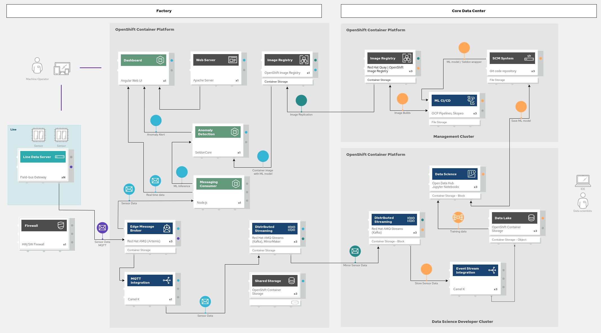

# Event Streaming from Edge to Core and filling the Data Lake <!-- omit in toc -->
This document describes how to prepare & execute the event streaming & data lake demo.

- [Prerequisites](#prerequisites)
  - [S3 Storage (optional)](#s3-storage-optional)
- [Demo Preparation](#demo-preparation)
- [Demo Execution](#demo-execution)
  - [Review the event streaming architecture](#review-the-event-streaming-architecture)
  - [Show that the S3 bucket is empty (optional)](#show-that-the-s3-bucket-is-empty-optional)
  - [Show the data flow from the factory to the central data center](#show-the-data-flow-from-the-factory-to-the-central-data-center)
  - [Persist data in S3 (optional)](#persist-data-in-s3-optional)

## Prerequisites


The management hub and factory edge clusters are up and running, sensor data is flowing into the IoT dashboard.


### S3 Storage (optional)

If you want to show data storage in S3, you need to have the S3 endpoint URL (or AWS region), accessKey and secretKey available. If you are OpenShift Container Storage Administrator, you can create a new account and retreive the access credentials through the NooBaa web UI. You can retreive its URL as OCP admin by going to the Administrator overview page and select the "Object Service" tab. There the link is available in the "Details" section under "System Name":

https://noobaa-mgmt-openshift-storage.apps.<cluster_name>.<base_domain>/fe/systems/noobaa

Log into the noobaa interface as Administrator. On the left hand side, select "Accounts", then click on the "Create Account" button. Create a new account typed "S3 Access Only" with a name like "manuela-kafka-to-s3".  Choose the backing store and select which buckets this user should have access to. Allow the user to create a new bucket. Once the creation completes, you are provided with access and secret key. Click on the cog icon in the top row ("System Management") and retrieve the external endpoint from the "Configuration" tab.

Install the s3cmd cli (OSX via homebrew). The S3 command examples in this demo guide expect the following environment values to be set (Note: if you don't have a conflicting configuration in your ~/.s3cmd file you can leave out --access_key and --secret_key params in the s3cmd commands once the env vars are set):

```bash
export AWS_ACCESS_KEY_ID=...
export AWS_SECRET_ACCESS_KEY=...
export S3_ENDPOINT=s3-openshift-storage.apps.<cluster_name>.<base_domain>
export BUCKET_NAME=...
```

If it doesn't exist yet, create a bucket to store the sensor data in, e.g. by using

```bash
s3cmd --access_key=$AWS_ACCESS_KEY_ID --secret_key=$AWS_SECRET_ACCESS_KEY --ssl --no-check-certificate --host=$S3_ENDPOINT mb "s3://$BUCKET_NAME"
```

## Demo Preparation

The end to end dataflow is already configured during the deployment of the hub and edge blueprints.


Validate that the sonsor data arrive in the central datacenter Kafka.

On the management hub, view the message in Kafka:

```
oc exec kafka-cluster-kafka-0 -c kafka -n manuela-data-lake-central-kafka-cluster -- bin/kafka-console-consumer.sh --topic manuela-factory.iot-sensor-sw-temperature --bootstrap-server kafka-cluster-kafka-bootstrap:9092
```
Expected result:
```
...
floor-1-line-1-extruder-1,pump-1,53.072835057671035,1604055357230
floor-1-line-1-extruder-1,pump-2,50.72915893457095,1604055358468
floor-1-line-1-extruder-1,pump-1,52.08060559322895,1604055362230
...
```

Exit the pod with ^C

## Demo Execution

### Review the event streaming architecture

This is a fairly technical demo module, so it makes sense to explain the complete data flow before diving into the technical details:

- Sensors use MQtt to communicate with the backend.
- MQtt data is buffered in Kafka in the factory DC via a Camel-K integration. 
- A second Kafka instance is deployed to the central DC
- MirrorMaker2 is deployed to the factory to replicate the sensor data from the factory DC to the central DC.
- All communications are initiated from the factory to the central DC.
- Everything configured does not use container images but is solely comprised of kubernetes artifacts and custom resources to configure Kafka, MirrorMaker2 and Camel-K integrations.




### Show that the S3 bucket is empty (optional)

See [View data persisted in S3 (optional)](#view-data-persisted-in-s3-optional) for details.


### Show the data flow from the factory to the central data center


 You can monitor the sensor data arriving in factory Kafka by running a Kafka consumer pod. Log into the factory (edge) openshift cluster with your OC client, then run:

```bash
oc run -n manuela-stormshift-messaging kafka-consumer  -ti --image=registry.access.redhat.com/amq7/amq-streams-kafka:1.1.0-kafka-2.1.1 --rm=true --restart=Never -- bin/kafka-console-consumer.sh --bootstrap-server manuela-kafka-cluster-kafka-bootstrap:9092 --topic iot-sensor-sw-temperature --from-beginning
```

You should be able to see the sensor data arriving in Kafka. Exit the pod with ^C.

You should also be able to see the data arriving in Kafka in the Central DC. Log into the openshift environment of the central datacenter (hub), then run

```bash
oc run -n manuela-data-lake-central-kafka-cluster kafka-consumer  -ti --image=registry.access.redhat.com/amq7/amq-streams-kafka:1.1.0-kafka-2.1.1 --rm=true --restart=Never -- bin/kafka-console-consumer.sh --bootstrap-server kafka-cluster-kafka-bootstrap:9092 --topic manuela-factory.iot-sensor-sw-temperature --from-beginning
```

Note the topic prefix "manuela-factory", created by MirrorMaker2. 
You should be able to see the sensor data arriving in Kafka. Exit the pod with ^C.

### Persist data in S3 (optional)

Configure the S3 secret key and deploy the S3 integration application:
```bash
cd ~/manuela-gitops
sed -i '' "s/  application.properties:.*/  application.properties: $(echo -e "  s3.accessKey: $AWS_ACCESS_KEY_ID\n  s3.secretKey: $AWS_SECRET_ACCESS_KEY" | base64)/" config/instances/manuela-data-lake/central-s3-store/s3-secret.yaml
ln -s ../../config/instances/manuela-data-lake/manuela-data-lake-central-s3-store.yaml deployment/execenv-factorydatacenter
git add .
git commit -m "Deploy S3 integration"
git push
```


Use the following command to list the contents of the bucket:
```bash
s3cmd --access_key=$AWS_ACCESS_KEY_ID --secret_key=$AWS_SECRET_ACCESS_KEY --ssl --no-check-certificate --host=$S3_ENDPOINT --host-bucket="s3://$BUCKET_NAME/" ls "s3://$BUCKET_NAME/" 
```

You can also use the Web UI to view the bucket contents. For OCS, log into the NooBaa web UI, select "Buckets" on the left hand menu, and navigate to the bucket.

If you want to copy a file to your local directory for examination, use:
```bash
export FILE_NAME=...
s3cmd --access_key=$AWS_ACCESS_KEY_ID --secret_key=$AWS_SECRET_ACCESS_KEY --ssl --no-check-certificate --host=$S3_ENDPOINT --host-bucket="s3://$BUCKET_NAME/" get "s3://$BUCKET_NAME/$FILE_NAME"
```

